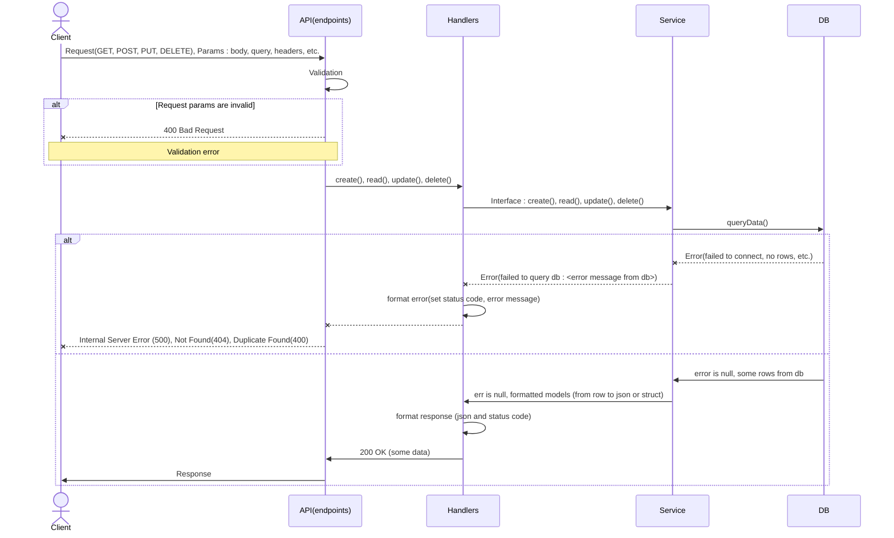

```mermaid
sequenceDiagram
 actor Client 
 participant API(endpoints)
 participant Handlers
 participant Service
 participant DB
Client ->> API(endpoints) : Request(GET, POST, PUT, DELETE), Params : body, query, headers, etc.
API(endpoints) ->> API(endpoints): Validation
    alt Request params are invalid
        API(endpoints) --x Client: 400 Bad Request
        Note over API(endpoints), Client: Validation error
    end
API(endpoints) ->> Handlers: create(), read(), update(), delete()
Handlers ->> Service: Interface : create(), read(), update(), delete()
Service ->>DB: queryData()

   alt 
       
DB --x Service: Error(failed to connect, no rows, etc.)
Service --x Handlers : Error(failed to query db : <error message from db>)
Handlers ->> Handlers : format error(set status code, error message)
Handlers --x API(endpoints) : 
    API(endpoints) --x Client: Internal Server Error (500), Not Found(404), Duplicate Found(400)
       else
       DB ->>Service: error is null, some rows from db
       Service ->> Handlers : err is null, formatted models (from row to json or struct)
       Handlers ->> Handlers : format response (json and status code)
       Handlers ->> API(endpoints) : 200 OK (some data)
   API(endpoints) ->> Client: Response
    end
```